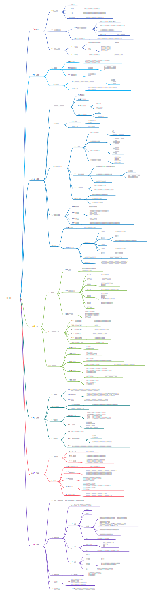

# 高效能人士的7个习惯
## 这本书讲了什么
作者用一生来研究和实践关于人生成功的方法论，包括了:
> 个人领域成功：分别为积极主动、以终为始、要事第一

> 公众领域成功：分别为双赢、知彼解己、统合综效
> 不断更新
简简单单7个方面帮助你快速剖析和管理你的人生。

## 你可以获得什么
一个实用的、底层的获得成功的方法论的具体实践参考，成功不只是财富，而是身心、社会关系，从内而外的成功。

## 思维导图
