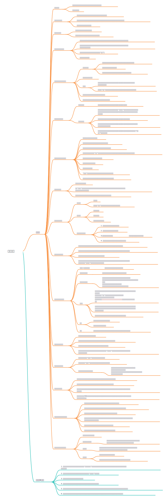
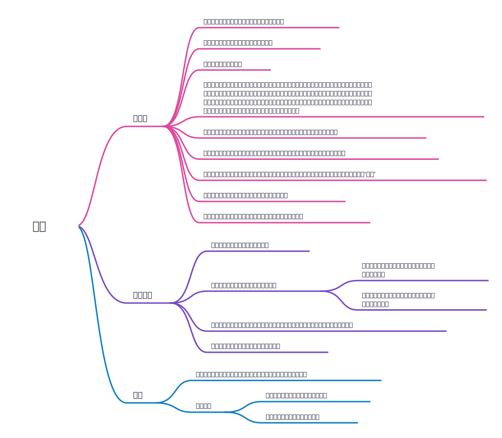
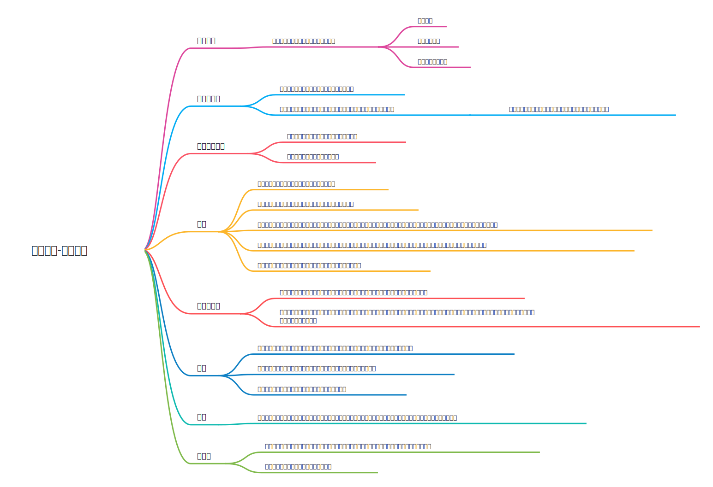

# 心灵力量

## 这里是什么
这里主要推荐一些对于心灵成长有帮助的书籍，它们于我而言是最重要的心灵的启蒙，也奠定了我的精神能量基础，奠定了我的世界观架构，希望你也可以从这些书籍中汲取到智慧，发现自己此生的使命。

## 与神对话
一个在与生活不断对抗，但不断落魄的人，在书写对于上帝的气愤的时候，内心出现了上帝的声音。
这本书需要你一遍一遍翻看，会带给你世界观的颠覆。如果你只需要一本找到内心秩序的书籍，如果你只需要一本找到精神力量的书籍，如果你只需要一本关于真理的书籍，那就是这本。

### 观看视频
<iframe height=498 width=510 src="//player.bilibili.com/player.html?aid=57934489&bvid=BV1G4411c7yG&cid=101100272&page=1&autoplay=0" scrolling="no" border="0" frameborder="no" framespacing="0" allowfullscreen="true"> </iframe>

## 思考致富
思考致富是成功学大师拿破仑希尔的书籍，她认为在宇宙中只有能量和物质两种类型，并且能量是可以转换为物质的。这本书相对于吸引力法则，它在书中更加强调了对于创造力的运用，并且给出了一套可以用于将能量转换为成功的方法。这本书不是教你自我欺骗，如果你看过与神对话，你将会认可这本书的内容。
### 观看视频
<iframe height=498 width=510 src="//player.bilibili.com/player.html?aid=718959894&bvid=BV1aQ4y1S7mN&cid=435111005&page=1&autoplay=0" scrolling="no" border="0" frameborder="no" framespacing="0" allowfullscreen="true"> </iframe>

### 思维导图

## 秘密
这本书是我看到的最早的关于吸引法则的一本书，如果只是看这一本的话多少会觉得有点虚，因为只是方法而不述说原则的话，很难对这本书的内容产生信任感。但是在经过与《与神对话》这本书的洗礼之后，《秘密》则会更加有吸引力，可以说是《与神对话》的小部分内容的现实阐释。
### 观看视频
<iframe height=498 width=510 src="//player.bilibili.com/player.html?aid=540468773&bvid=BV1Ri4y1t7jv&cid=185092706&page=1&autoplay=0" scrolling="no" border="0" frameborder="no" framespacing="0" allowfullscreen="true"> </iframe>

### 思维导图

## 臣服实验，迈克尔·伯格
和书名提到的臣服不同，作者指的是把心放在当下你能做的事情上，而不是担心和恐惧，当你把心从恐惧上移开，你会消解这份能量的阻塞，甚至能帮助你的能量更上一层楼。臣服实验这本书是作者一生的经历，着眼于心中和当下，他所做的一切，没有欲望和焦虑，而是不断执着于当下，你能获得你想要拥有的一切。

## 视频
<iframe src="//player.bilibili.com/player.html?aid=650089566&bvid=BV1Be4y1G748&cid=957891364&page=1" scrolling="no" border="0" frameborder="no" framespacing="0" allowfullscreen="true"> </iframe>

### 思维导图

