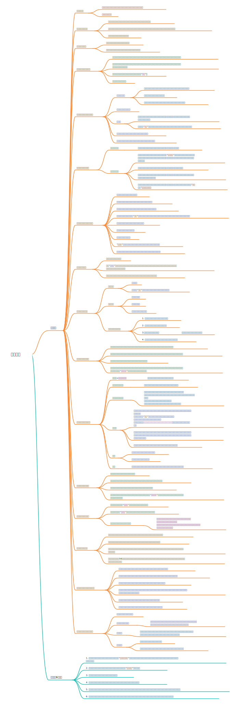
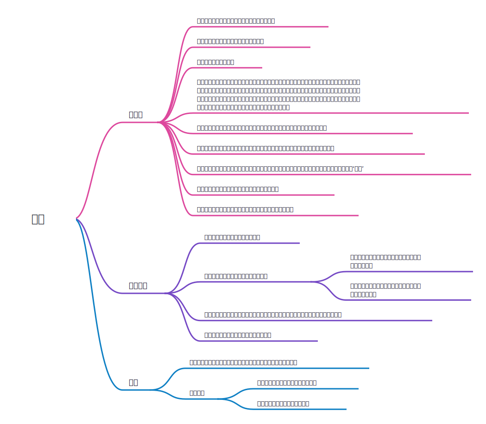

# 心灵力量

## 这里是什么
这里主要推荐一些对于心灵成长有帮助的书籍，它们于我而言是最重要的心灵的启蒙。

## 与神对话

## 臣服实验

## 思考致富
### 观看视频
<iframe height=498 width=510 src="//player.bilibili.com/player.html?aid=718959894&bvid=BV1aQ4y1S7mN&cid=435111005&page=1&autoplay=0" scrolling="no" border="0" frameborder="no" framespacing="0" allowfullscreen="true"> </iframe>

### 思维导图

## 秘密
这本书是我看到的最早的关于吸引法则的一本书，如果只是看这一本的话多少会觉得有点虚，因为只是方法而不述说原则的话，很难对这本书的内容产生信任感。但是在经过与《与神对话》这本书的洗礼之后，《秘密》则会更加有吸引力，可以说是《与神对话》的小部分内容的现实阐释。
### 观看视频
<iframe height=498 width=510 src="//player.bilibili.com/player.html?aid=540468773&bvid=BV1Ri4y1t7jv&cid=185092706&page=1&autoplay=0" scrolling="no" border="0" frameborder="no" framespacing="0" allowfullscreen="true"> </iframe>

### 思维导图
